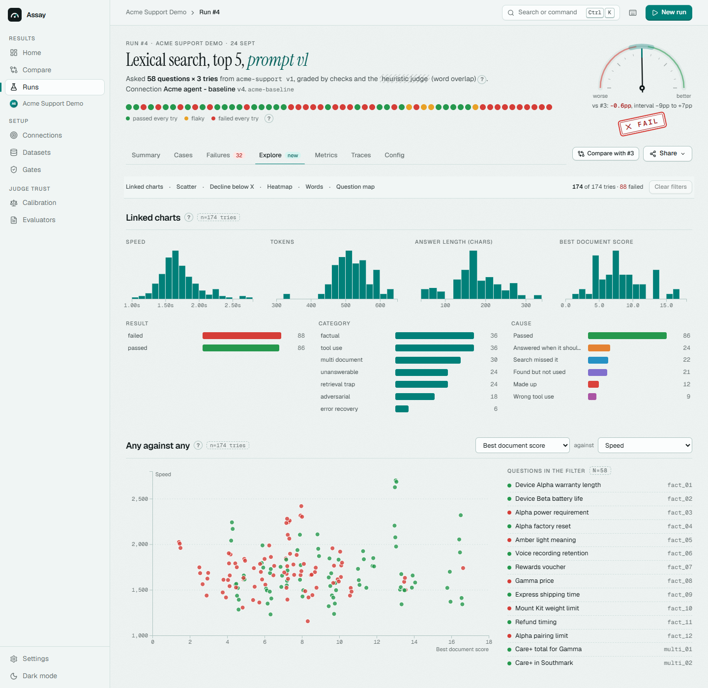
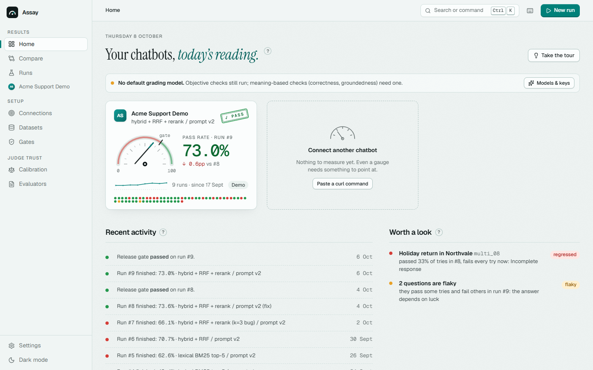
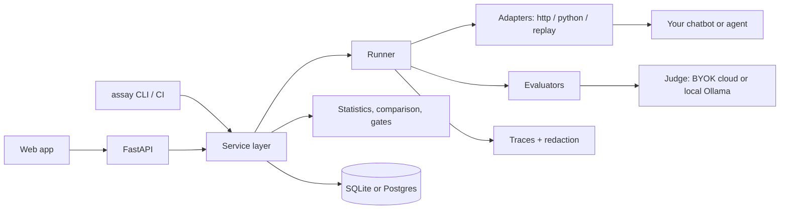

# Assay

[](https://github.com/wenhaoyay/assay/actions/workflows/ci.yml)

**Regression testing for RAG chatbots and tool-using agents: change the model, prompt, retriever
or tools, and find out whether the system got better, worse, slower, more expensive or less reliable,
with the uncertainty stated.**


Assay runs a versioned golden dataset against two or more versions of a system, grades every
answer with objective checks first and an LLM judge only where meaning has to be judged, and
compares the versions case by case. It is framework-agnostic: anything that answers over HTTP,
any Python function, or a log of past answers can be evaluated. It is a local, single-user
workbench.

## Try it in one minute

Requires Python 3.12+ and Node 20+. The demo uses a fictional support agent ("Acme") and costs
nothing: no API keys are needed.

```bash
make setup     # venv + Python and web dependencies
make web       # build the web app
make demo      # seed the Acme demo, run baseline + candidate (about 10 seconds)
make serve     # http://localhost:8040
```

For three weeks of demo history (the screenshots below), use `make demo-fresh` instead of
`make demo`; it starts from an empty database, so stop the server first. Without `make`
(for example on Windows), see [Quick start](#quick-start).

| | | |
|---|---|---|
|  |  |  |
| **Verdict first.** One sentence on whether the latest version is better, worse or within noise. | **Why it failed.** One row per question, tinted by its likely cause. | **Trust the judge.** Label blind; agreement with the grading model fills in as you go. |

## What it does

- **Connects any chatbot** by pasting a curl command, a Python function or a log of answers; no
  config file needed.
- **Compares versions on paired cases**, with bootstrap confidence intervals and a plain
  reading: *better*, *worse* or *within noise*.
- **Grades objectively first.** Deterministic, retrieval, agent and budget checks need no model;
  an LLM judge is used only where meaning must be judged.
- **Calibrates the judge** against your own blind labels (accuracy, F1, Cohen's kappa, a
  confusion matrix) and ranks grading models in a bake-off.
- **Explains failures** with a likely cause, the evidence and the execution trace behind each
  answer, and says what to fix first.
- **Builds golden datasets** from documents, chat history or flashcards; nothing enters a
  dataset until a person approves it, and versions freeze once used.
- **Gates releases**, in the UI and in CI at zero API cost: the CLI exits 1 when a gate fails.
- **Keeps data local.** SQLite by default, keys in the OS credential store, and a target can be
  restricted to local grading models.

The full feature list, an example evaluation with numbers, and the methodology summaries are in
[docs/overview.md](docs/overview.md).

## Screenshots

| | |
|---|---|
|  |  |
| **A chatbot's home.** Three weeks in one sentence, the timeline of comparable runs with what changed, every question across every run. | **Run summary.** The run's fingerprint, figures against the baseline, where the answers went, what to fix first. |
|  |  |
| **Explore.** Linked charts you filter by dragging, any measure against any, and "what if the bot declined below a score?". | **Today's reading.** Each chatbot's latest run on a gauge, its fingerprint, what happened and what is worth a look. |
|  |  |
| **Failures.** One row per question, tinted by its likely cause; J/K and Enter to triage. | **A failed trial.** The verdict once, citations linked to the passages the bot read, a replay of what it did. |
|  |  |
| **Trace.** Request, retrieval, model and tool calls with timings; the slowest step called out; the checks that graded it. | **Results across runs.** A case red in every run is often a wrong golden answer, not a bad bot. |
|  |  |
| **Connect a chatbot.** Paste curl, send a question, click the reply; Assay guesses, you confirm. | **Models & keys.** Bring a better grading model; keys live in the OS credential store. |
|  |  |
| **Calibration.** Label blind with P / F / U; agreement with the judge fills in as you go. | **Dark mode**, designed rather than inverted: warm blacks, figures that glow. |

## Architecture



The UI and the CLI share one service layer, so a CI run and a UI run execute the same code.
See [docs/architecture.md](docs/architecture.md).

## Quick start

Requires Python 3.12+ and Node 20+.

```bash
git clone <this repo> assay && cd assay
cp .env.example .env            # optional: only needed for cloud judge keys
make setup                      # venv + Python and web dependencies
make web                        # build the web app
make demo                       # migrate, seed the Acme demo, run baseline + candidate (~10 s)
make serve                      # http://localhost:8040
```

Open it and press **Take the tour** on the home page (or Ctrl+K > "Take the tour"): eight
steps from a chatbot's verdict to connecting your own bot. `assay seed --run --history --fresh`
(`make demo-fresh`) starts again from an empty database - stop the server first.

Without `make` (for example on Windows):

```bash
python -m venv .venv && .venv/Scripts/pip install -e ".[dev,pdf]"      # .venv/bin on macOS/Linux
cd apps/web && npm ci && npm run build && cd ../..
.venv/Scripts/assay seed --run
.venv/Scripts/assay serve
```

With Docker (Postgres, API + web app, demo agent):

```bash
docker compose up --build       # http://localhost:8040 ; demo agent on :9040
```

The database defaults to SQLite at `data/assay.db`. Set `DATABASE_URL` for Postgres.


## Documentation

- [Overview](docs/overview.md): features, example evaluation, layout, tests, CI gate, roadmap
- [Architecture decision records](docs/adr/README.md):
  [paired comparison](docs/adr/0001-paired-comparison-with-bootstrap-intervals.md),
  [objective checks first](docs/adr/0002-objective-checks-first.md),
  [local-first workbench](docs/adr/0003-local-first-single-user-workbench.md),
  ["not measured", never a pass](docs/adr/0004-not-measured-is-never-a-pass.md),
  [datasets freeze on first use](docs/adr/0005-datasets-freeze-on-first-use.md)
- [Evaluation methodology](docs/evaluation-methodology.md), [judge calibration](docs/judge-calibration.md),
  [finding the cause](docs/finding-the-cause.md), [connecting a target](docs/connecting-a-target.md),
  [local models](docs/local-models.md), [trace schema](docs/trace-schema.md),
  [security and privacy](docs/security-and-privacy.md), [architecture](docs/architecture.md)
- [Changelog](CHANGELOG.md)

## Tests and CI

124 pytest tests, 21 Vitest tests and 9 Playwright tests. GitHub Actions runs five jobs on every
push to `main` and every pull request: backend lint, types and tests on SQLite; migrations and
the full demo on Postgres; the web app; the end-to-end flows; and an evaluation regression gate
at zero API cost that also proves the gate fails on a deliberately regressed candidate. Locally:
`make test`, `make e2e`, `make ci`. See [docs/overview.md](docs/overview.md#tests).

## Limitations

- **Single user, local.** No authentication or multi-tenancy. Runs execute inside the API
  process, not on a job queue, and a restart marks in-flight runs as interrupted.
- **The demo agent is simulated.** Its weaknesses are mechanisms (lexical retrieval, a
  refusal rule, a tool-argument slip), not per-question scripts, but the numbers say nothing
  about real model quality. A real model can be plugged in through Ollama.
- **The heuristic judge is shallow.** It exists so CI is free and it never fails a trial by
  itself. Semantic grading needs an LLM judge, and an LLM judge needs calibration.
- **Small samples.** Fifty-eight cases give intervals of roughly ±13 percentage points.
  Assay reports that rather than hiding it.
- **Docker untested here.** Development ran on SQLite on Windows; the Postgres path is
  exercised by the GitHub Actions job. The Docker Compose stack is written but has not been
  run: the development machine has no Docker.
- **A check a connection cannot measure is left out, not passed.** When a connection does not
  map a check's telemetry (say, no sources), that check shows as not measured and the pass rate
  rests on the others; an answer whose required check could not decide is unscored, never
  passed. The spend cap reserves each answer's expected cost, but the first answers of a run
  start before any cost is known.
- **Not implemented:** OpenTelemetry export, multi-turn conversation simulation, parallel
  annotators with inter-annotator agreement in the UI.

The roadmap is in [docs/overview.md](docs/overview.md#roadmap).

## License

MIT
