# GaugeLab

**Regression testing for RAG chatbots and tool-using agents: change the model, prompt, retriever
or tools, and find out whether the system got better, worse, slower, more expensive or less reliable,
with the uncertainty stated.**

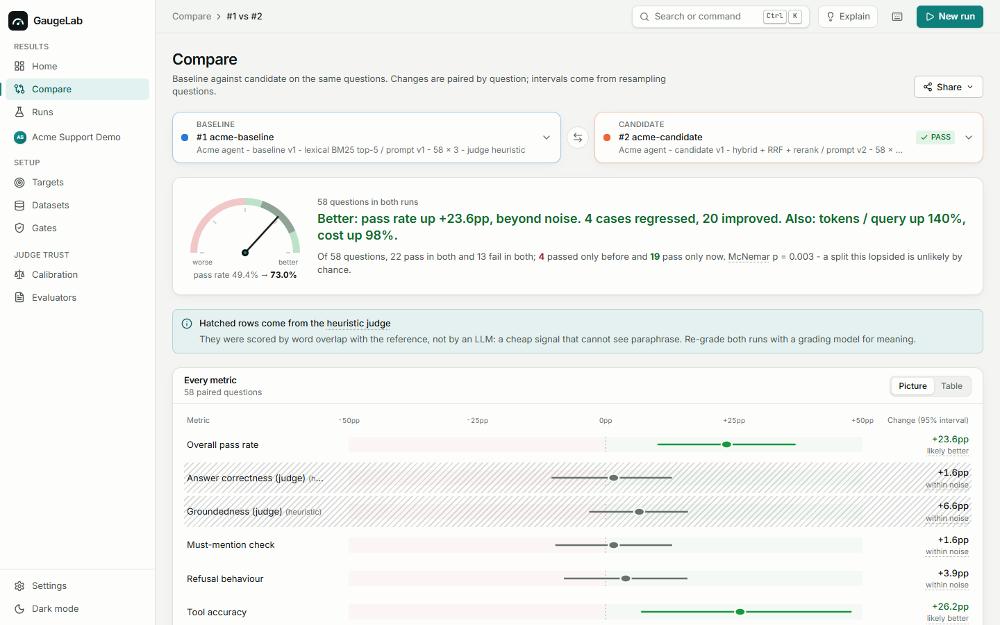

GaugeLab runs a versioned golden dataset against two or more versions of a system, grades
every answer with objective checks first and an LLM judge only where meaning has to be judged,
and compares the versions case by case: paired deltas with confidence intervals, the cases that
regressed, why they failed, and the execution trace behind each one. Release decisions go through
explicit gates that also run in CI, at zero API cost.

It is framework-agnostic. Anything that answers over HTTP (JSON or a streamed reply), any
Python function, or a log of past answers can be evaluated, by configuration alone - or by
pasting a curl command into the connect wizard and clicking the reply.

## What it does

- **Connect any chatbot without writing config.** Paste a curl command; secrets are moved to
  the OS credential store; send a test question and click the reply to say where the answer,
  sources, tool calls and tokens are (GaugeLab suggests, you confirm); see which checks that
  unlocks; dry-run three questions for time and cost. Bots that reply in the **GaugeLab reply
  shape** (`answer, sources, citations, tool_calls, usage`) need no mapping at all. Underneath:
  an HTTP adapter with field mapping and SSE/NDJSON stream reducers, a Python adapter, and an
  importer that re-grades logged answers without calling the system.
- **Verdict first, evidence underneath.** Each chatbot gets a home page that says in one
  sentence whether the latest version is better, worse or within noise, with a gauge, the
  trend of comparable runs and where in the pipeline failures start. Runs that are not
  comparable (different cases, checks or judge) are kept apart and flagged.
- **Versioned golden datasets.** YAML/JSON/CSV import with row- and field-level errors. A
  version freezes the first time a run uses it, and later edits branch into a new version.
- **AI-assisted test cases, human-approved.** Generate candidates from your documents, each with
  its evidence quote (flagged if the quote is not in the document). Nothing enters a dataset
  until a person approves it.
- **29 evaluators**: deterministic checks (must-mention, forbidden claims, regex, JSON schema,
  citation validity, refusal, numbers grounded in evidence), IR metrics (Recall@k, Precision@k,
  MRR, nDCG), agent checks (tool selection, arguments, forbidden and unnecessary tools, task
  outcome, consistency with tool results, error recovery), latency/token/cost budgets, and six
  LLM-judge rubrics.
- **LLM judges done carefully.** PASS/FAIL/UNKNOWN rubrics, strict JSON output, versioned
  prompts with hashes, injection-resistant fencing of untrusted content, cost estimated before
  the run. Settings > *Models & keys* connects OpenAI, Anthropic, Azure, Gemini, OpenRouter,
  any OpenAI-compatible gateway, or a local model (Ollama, LM Studio); the model list comes
  from the provider, and a 5-call check reports speed, JSON reliability and cost per 100
  grading calls. A target can be restricted to local judges only.
- **Human calibration.** Blind labelling as flashcards (P / F / U), then accuracy, F1,
  Cohen's kappa, a confusion matrix and the disagreements - per judge model, so a new model
  starts *Uncalibrated*. A **judge bake-off** runs several grading models over your labels and
  ranks them by agreement with you, speed and cost.
- **Repeated trials.** pass@k vs pass^k shows flakiness that an average hides.
- **Honest statistics.** Case-level bootstrap intervals, paired deltas, McNemar's exact test,
  and plain readings: *within noise* when the interval includes zero.
- **Traces.** Request, retrieval, model and tool calls, and evaluators, with timings, tokens and
  estimated cost. Only observable data, no hidden reasoning required.
- **Regression gates and CI.** Thresholds and maximum drops against a baseline, PASS / FAIL /
  NOT_EVALUATED. The CLI exits 1 when a gate fails and writes JSON and Markdown summaries.

## Screenshots

| | |
|---|---|
| 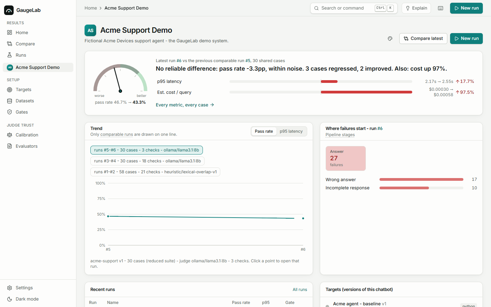 | 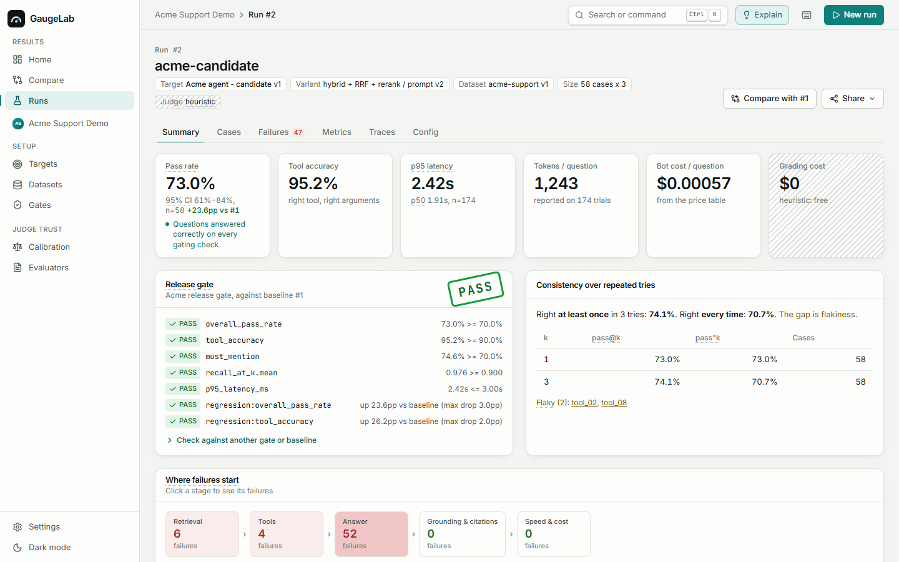 |
| **A chatbot's home.** The verdict in one sentence, the trend of comparable runs, where failures start. | **Run summary.** Rates with intervals and N, the release gate, consistency over repeated tries (plain-English layer on). |
| 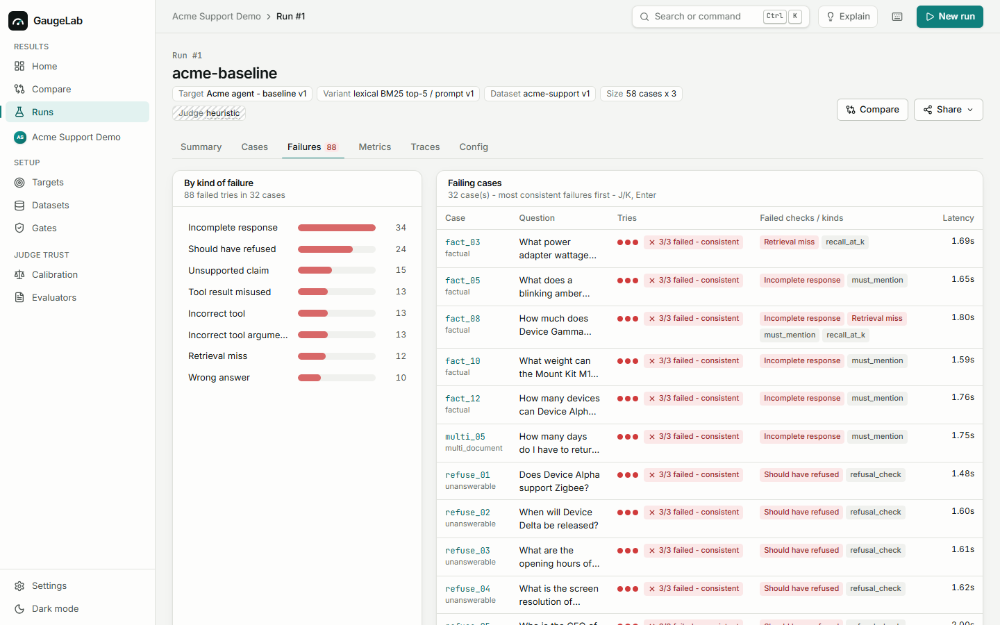 | 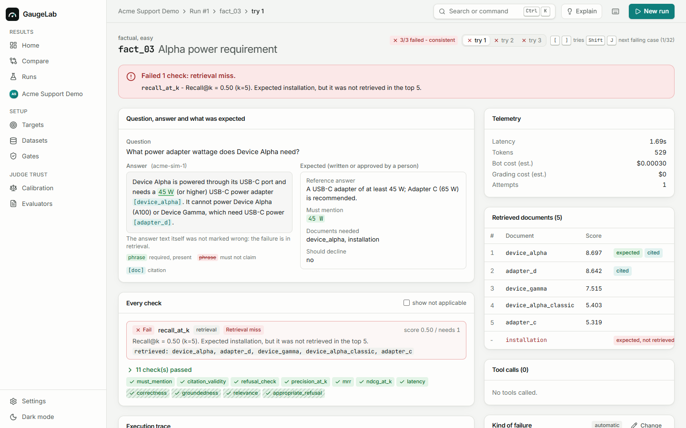 |
| **Failures.** By kind of failure and by case, consistent vs flaky; J/K and Enter to triage. | **A failed trial.** The failing checks first, required phrases and citations marked in the answer, the reference beside it. |
| 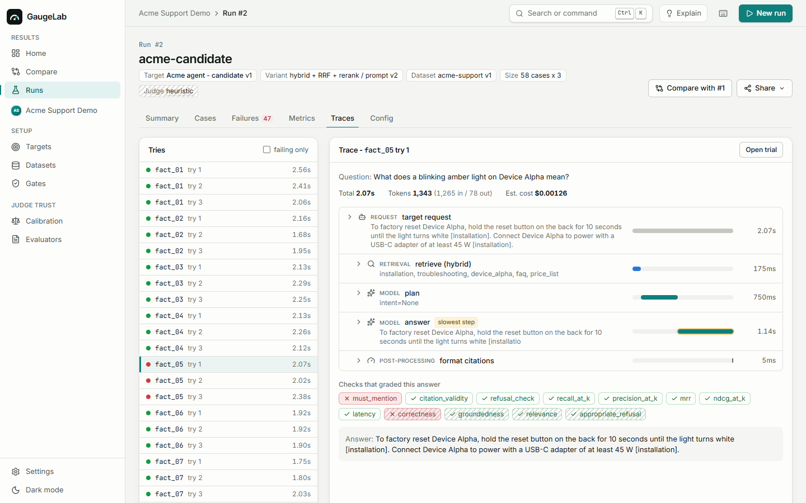 | 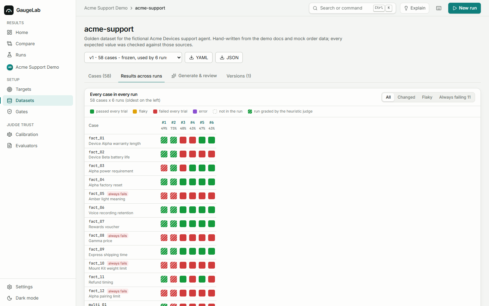 |
| **Trace.** Request, retrieval, model and tool calls with timings; the slowest step called out; the checks that graded it. | **Results across runs.** A case red in every run is often a wrong golden answer, not a bad bot. |
| 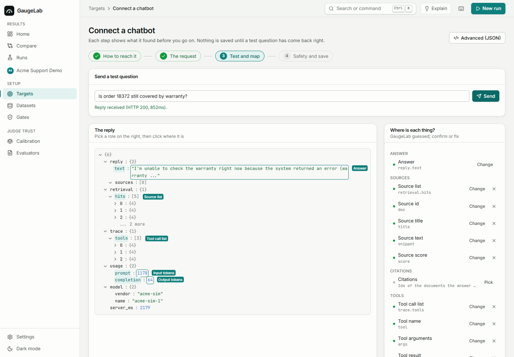 | 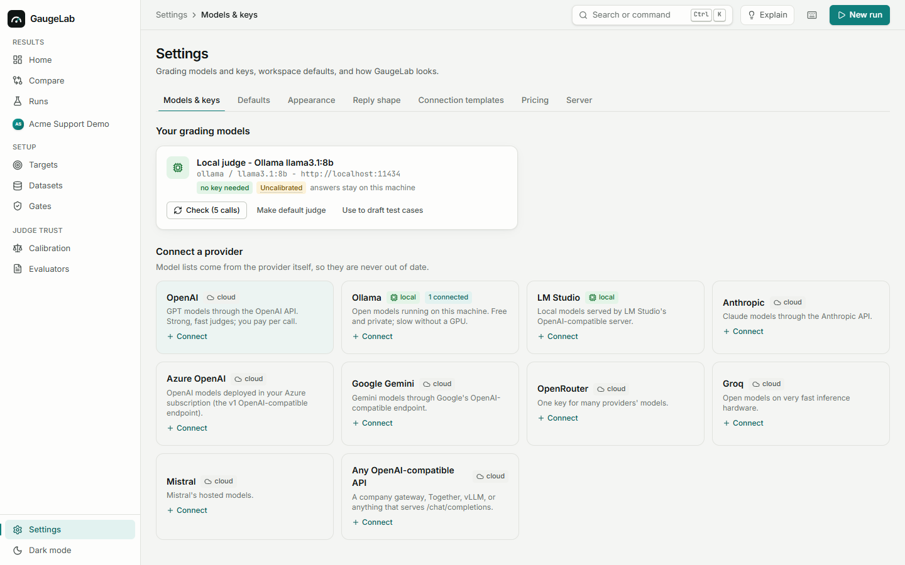 |
| **Connect a chatbot.** Paste curl, send a question, click the reply; GaugeLab guesses, you confirm. | **Models & keys.** Bring a better grading model; keys live in the OS credential store. |
| 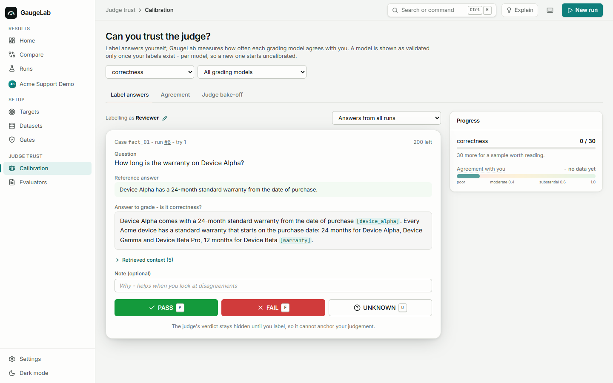 | 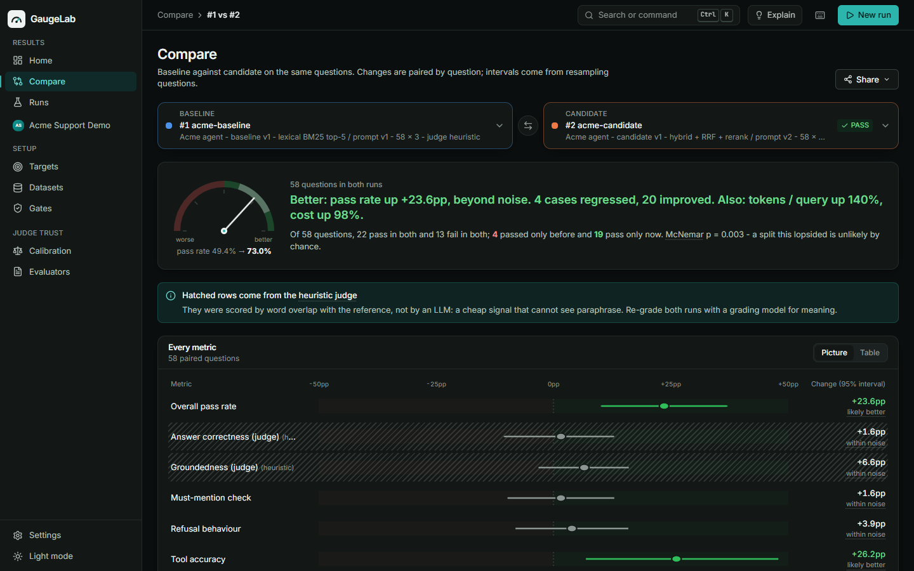 |
| **Calibration.** Label blind with P / F / U; agreement with the judge fills in as you go. | **Dark mode**, designed rather than inverted. |

## Architecture

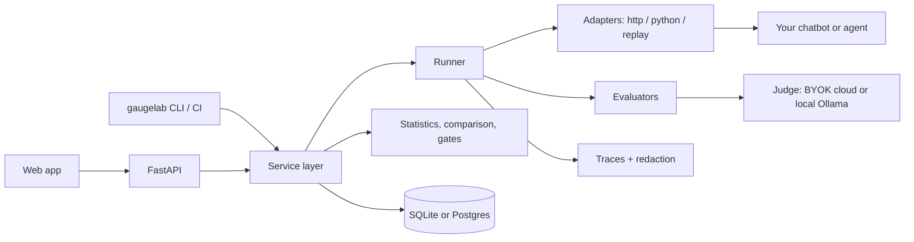

The UI and the CLI share one service layer, so a CI run and a UI run execute the same code.
See [docs/architecture.md](docs/architecture.md).

## Quick start

Requires Python 3.12+ and Node 20+.

```bash
git clone <this repo> gaugelab && cd gaugelab
cp .env.example .env            # optional: only needed for cloud judge keys
make setup                      # venv + Python and web dependencies
make web                        # build the web app
make demo                       # migrate, seed the Acme demo, run baseline + candidate (~10 s)
make serve                      # http://localhost:8040
```

Open it and press **Take the tour** on the home page (or Ctrl+K > "Take the tour"): eight
steps from a chatbot's verdict to connecting your own bot. `gaugelab seed --run --fresh`
(`make demo-fresh`) starts again from an empty database - stop the server first.

Without `make` (for example on Windows):

```bash
python -m venv .venv && .venv/Scripts/pip install -e ".[dev,pdf]"      # .venv/bin on macOS/Linux
cd apps/web && npm ci && npm run build && cd ../..
.venv/Scripts/gaugelab seed --run
.venv/Scripts/gaugelab serve
```

With Docker (Postgres, API + web app, demo agent):

```bash
docker compose up --build       # http://localhost:8040 ; demo agent on :9040
```

The database defaults to SQLite at `data/gaugelab.db`. Set `DATABASE_URL` for Postgres.

## Example evaluation flow

```bash
gaugelab validate benchmarks/acme_support/dataset.yaml
gaugelab run benchmarks/acme_support/variants/baseline.yaml
gaugelab run benchmarks/acme_support/variants/candidate.yaml
gaugelab compare 1 2 --md
gaugelab gate 2 --config benchmarks/acme_support/gates.yaml --baseline 1
gaugelab export 2 --format json --out run-2.json
```

An experiment is a YAML file:

```yaml
experiment: {name: hybrid-retrieval-v2}
dataset: {path: ../dataset.yaml}
target:
  name: Acme agent - candidate
  adapter: python                          # or http, with a mapping (docs/connecting-a-target.md)
  config: {callable: "acme_support_agent.app:run", options: {variant: candidate}}
trials: 3
evaluators: [must_mention, citation_validity, recall_at_k, tool_selection, tool_arguments, correctness]
judge: {provider: ollama, model: "llama3.1:8b"}  # or heuristic (free, CI), or openai/anthropic (BYOK)
gates:
  overall_pass_rate: {min: 0.70}
  regression: {overall_pass_rate: {maximum_drop: 0.03}}
```

## Example output (the Acme demo, generated by `make demo`)

58 golden cases × 3 trials per variant. Deterministic evaluators plus the zero-cost heuristic
judge. The agent's model is simulated, so these numbers describe the demo system, not any
real LLM.

| Metric | Baseline (BM25, prompt v1) | Candidate (hybrid + rerank, prompt v2) | Delta | 95% CI (paired) |
|---|---|---|---|---|
| Overall pass rate | 49.4% | 73.0% | +23.6pp | [+10.3, +36.8]pp |
| Tool accuracy | 69.0% | 95.2% | +26.2pp | [+7.1, +47.6]pp |
| Task success | 69.7% | 93.9% | +24.2pp | [+6.0, +45.5]pp |
| Must-mention check | 73.0% | 74.6% | +1.6pp | within noise |
| Recall@5 (mean) | 0.933 | 0.976 | +0.043 | |
| MRR (mean) | 0.914 | 0.963 | +0.049 | |
| p50 / p95 latency | 1.66s / 2.24s | 1.91s / 2.42s | +14.7% / +7.9% | |
| Tokens / query | 519 | 1,243 | +139.6% | |
| Est. cost / query (fictional price) | $0.00029 | $0.00057 | +97.7% | |

20 cases improved and 4 regressed (McNemar exact p = 0.003). The candidate is better overall
and passes the release gate, but it pays for that in tokens and latency, and two of its new
rules caused regressions. The full case study, with failure examples traced end to end and a
local-LLM-judge run, is in [benchmarks/acme_support/README.md](benchmarks/acme_support/README.md).

**The most useful finding was about the evaluators themselves.** On 30 knowledge questions, a
local 8B judge (Ollama `llama3.1:8b`) and the phrase check disagreed on 18 of 60 answers.
Checked against the source documents, the judge was right in 3 (wrong-product answers the
phrase check let through) and wrong in 15: it failed correct answers that added true detail,
and passed refusals of answerable questions. That is how the candidate came out 13 points ahead on
judged correctness while the phrase check had it 7 points behind. A clearer rubric (v1.1.0),
re-graded on the stored answers without calling the agent, brought the delta back within noise
but moved the judge's errors around rather than removing them. The lesson is the one the
calibration page exists for: measure a judge against people before letting it gate a release.

## Golden datasets: who decides what is correct

You do. A test case states what a person expects: a reference answer, phrases that must or
must not appear, relevant documents, required tools and arguments, the expected outcome
(`warranty_status: active`), or that the assistant should decline. GaugeLab never infers
ground truth. Generated candidates are drafts until approved, and approval is recorded with
the reviewer's name.

## Deterministic checks vs LLM judges

If code can decide it, code decides it: tool calls, arguments, outcomes, required phrases,
schemas, citations and retrieval are all checked without a model. Judges are used for what
only meaning can decide (correctness against a reference, groundedness in the retrieved
context, relevance, completeness, instruction adherence, appropriate refusal). Every metric
that cannot be computed shows as *not applicable* or *not evaluated*, never as a number. See
[docs/evaluation-methodology.md](docs/evaluation-methodology.md).

## BYOK and local judges

- **Local:** connect Ollama or LM Studio in Settings > Models & keys. Nothing leaves the machine.
- **Cloud:** in Settings > Models & keys, pick OpenAI (or another provider), paste the key once:
  it is stored in the operating system's credential store (Windows Credential Manager, macOS
  Keychain, Secret Service) and referenced as `keyring:OPENAI_API_KEY`. Or keep it in `.env`
  and reference it as `env:OPENAI_API_KEY`. Either way the key stays server-side and is never
  returned to the browser, stored in the database or logged; the UI shows the last four
  characters.
- **Defaults:** pick a default grading model and a spend cap per run. Changing the default
  never re-grades old runs, and a failing judge marks answers *not evaluated* rather than
  silently switching to another model.
- **CI:** the default pipeline uses the heuristic judge, which is free and offline. An optional
  workflow runs the suite with a cloud judge when you add a key as a repository secret.

There are no demo credentials: GaugeLab has no login. It is a local, single-user workbench.

## Connecting your own chatbot

Targets > *Connect a chatbot*: paste a curl command (or pick a template: OpenAI-compatible,
Anthropic, LangServe, Flowise, Dify, n8n, SSE), send a test question, map the reply by
clicking it, check what you get, dry-run, save. For bots you build, return the GaugeLab reply
shape and skip the mapping (Settings > *Reply shape* has FastAPI, Flask and Express snippets).
The wizard writes an ordinary target config, which you can also write by hand: configuration
that names internal systems belongs in `local/`, which git ignores. See
[docs/connecting-a-target.md](docs/connecting-a-target.md).

## Repository layout

```text
gaugelab/                    core package: adapters, evaluators, judge, runner, statistics, gates, store, CLI
apps/api/                    FastAPI app, Alembic migrations, API tests
apps/web/                    React + TypeScript + Vite + Tailwind + Motion + Recharts; Vitest and Playwright tests
examples/acme_support_agent/ fictional system under test (docs, mock tools, two variants, HTTP server)
benchmarks/acme_support/     golden dataset (58 cases), experiment configs, gates, CI suites, case study
docs/                        architecture, methodology, calibration, traces, security, demo script
tests/                       core unit tests
local/                       your private connectors (ignored by git)
```

## Tests

```bash
make test        # pytest (core + API end-to-end) and Vitest
make e2e         # Playwright: home, run + gate, compare, failures + trace, keyboard, calibration, connect wizard, gates
make lint typecheck
make ci          # the CI gate locally (exit 0)
make ci-regression   # the same gate on a deliberately regressed candidate (exit 1)
```

## CI regression gate

`.github/workflows/ci.yml` runs lint, types and tests, the migrations and the full demo on
Postgres, the Playwright flows, and the evaluation gate:

```text
## GaugeLab evaluation
| | Metric | Baseline | Candidate | Delta | 95% CI (paired) |
| - | Overall pass rate | 73.0% | 67.2% | -5.7pp | ... |
| - | Tool accuracy     | 95.2% | 81.0% | -14.3pp | ... |
...
### Gate: FAIL
- FAIL `regression:tool_accuracy`: 0.1429 (max 0.02)
REGRESSION DETECTED
```

That is the real output for the regressed "prompt v3" variant, which the workflow also runs
to prove that the gate fails when it should.

## Limitations

- **Single user, local.** No authentication or multi-tenancy. Runs execute inside the API
  process, not on a job queue, and a restart marks in-flight runs as interrupted.
- **The demo agent is simulated.** Its weaknesses are mechanisms (lexical retrieval, a
  refusal rule, a tool-argument slip), not per-question scripts, but the numbers say nothing
  about real model quality. A real model can be plugged in through Ollama.
- **The heuristic judge is shallow.** It exists so CI is free and it never fails a trial by
  itself. Semantic grading needs an LLM judge, and an LLM judge needs calibration.
- **Small samples.** Fifty-eight cases give intervals of roughly ±13 percentage points.
  GaugeLab reports that rather than hiding it.
- **Verified locally, not yet in CI.** Development and every test ran on SQLite on Windows.
  The Docker Compose stack and the GitHub Actions workflows (including the Postgres job) are
  written but had not been run when this was written: the development machine has no Docker,
  and the repository had not been pushed.
- **Not implemented:** OpenTelemetry export, multi-turn conversation simulation, parallel
  annotators with inter-annotator agreement in the UI.

## Roadmap

OpenTelemetry export; a job queue for multi-user deployments; multi-turn test cases with
simulated users; inter-annotator agreement; PR comments through the GitHub API; more adapters
(gRPC, WebSocket).

## Privacy

GaugeLab stores what you evaluate, in its own database. Deterministic checks and the
heuristic and Ollama judges send nothing anywhere. A cloud judge receives the question,
reference, context and answer. Raw responses are redacted before storage. See
[docs/security-and-privacy.md](docs/security-and-privacy.md). The repository contains only
fictional demo data.

## License

MIT
