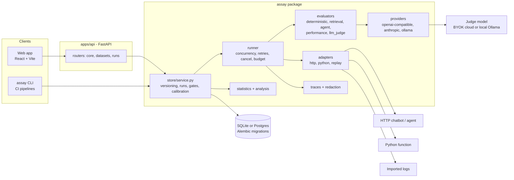
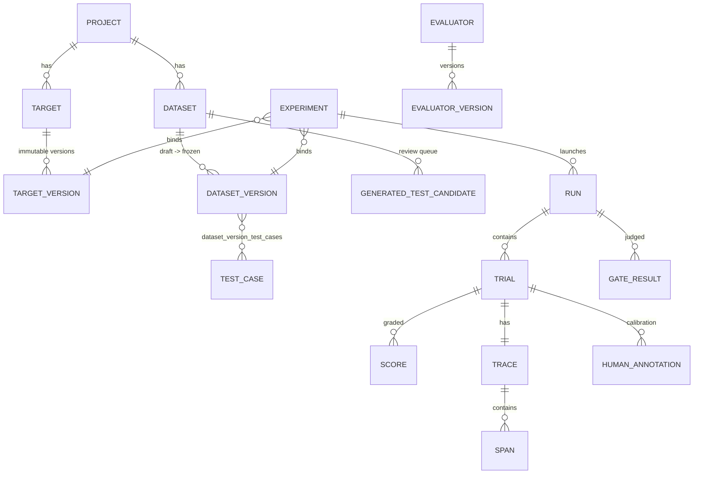

# Architecture

Assay is one Python package (`assay/`) with two front doors, a FastAPI app
(`apps/api`) and a CLI (`assay`), plus a React web app (`apps/web`). The front doors
share one service layer, so a run started from the UI and a run started in CI execute
the same code.



## Components

| Path | Responsibility |
|---|---|
| `assay/schemas.py` | The contracts: `NormalizedTargetResult`, `TestCase`, `Trace`/`Span`, `EvaluationResult` |
| `assay/adapters/` | Get a normalized result for one input: `http` (mapping + SSE/NDJSON reducers + clean-up), `python` (call a function), `replay` (imported results) |
| `assay/evaluators/` | 30 evaluators behind one interface, registered by id |
| `assay/evaluators/llm_judge/` | Versioned YAML rubrics, prompt construction, strict output parsing, the heuristic stand-in |
| `assay/providers/` | Thin HTTP clients for OpenAI-compatible, Anthropic and Ollama, with bounded retries |
| `assay/runner/` | Executes (case, trial) pairs; knows nothing about databases |
| `assay/analysis.py` | Aggregates, failure taxonomy, baseline-vs-candidate comparison |
| `assay/diagnosis.py` | Why a failed answer failed: rule-based causes with evidence and the fix (`store/causes.py` applies them to runs, overrides, model explanations and grouped notes) |
| `assay/statistics/` | Bootstrap, McNemar, pass@k / pass^k, Cohen's kappa, Spearman |
| `assay/gates/` | Threshold and relative-regression gates |
| `assay/store/` | SQLAlchemy models, the service layer, imports |
| `assay/config_run.py` | Experiment YAML -> versioned entities (config as code) |
| `apps/api/` | REST endpoints (OpenAPI at `/docs`), Alembic migrations, serves the built web app |
| `apps/web/` | The UI |
| `examples/acme_support_agent/` | A fictional system under test |

## Execution flow of a run

```mermaid
sequenceDiagram
  participant U as UI / CLI
  participant S as service
  participant R as runner
  participant A as adapter
  participant E as evaluators
  participant D as database
  U->>S: start_run(experiment)
  S->>D: freeze dataset version, snapshot target/evaluators/judge
  S->>R: RunSpec(cases, adapter, evaluators, judge, trials...)
  loop every case x trial (bounded concurrency)
    R->>A: call(input) with retry on transient errors only
    A-->>R: NormalizedTargetResult + raw payload
    R->>R: build trace (spans), estimate cost
    R->>E: evaluate (deterministic first; judge only where configured)
    R->>D: persist trial, scores, spans (redacted raw)
  end
  S->>D: aggregate summary (case-level rates, CIs, failures)
  U->>S: compare / gate / export
```

## Data model



Reproducibility is enforced by the schema rather than by convention:

- **Test cases are immutable rows.** Editing a case writes a new row. A dataset version is
  a list of case rows.
- **A dataset version freezes the first time a run uses it.** After that, an edit
  automatically goes to a child draft version, and the UI says so.
- **Target configurations are versioned the same way.** An experiment points at a version,
  never at "the current target".
- **A run stores a snapshot** of the target configuration and hash, the dataset version and
  content hash, the evaluator versions (judges include rubric version and prompt hash), the
  judge provider, model and temperature, and the experiment settings. An old run stays
  interpretable after anything current changes.
- **Secrets are never stored**, only `env:NAME` references.

## Adapter design

Every target produces a `NormalizedTargetResult`. Only `answer` is required. Every other
field is `None` when the target did not report it, and evaluators then return
`not_evaluated` instead of inventing a number:

```json
{
  "answer": "string",
  "citations": [{"id": "..."}],
  "retrieved_documents": [{"id": "...", "title": "...", "score": 0.91, "text": "..."}],
  "tool_calls": [{"name": "check_warranty", "arguments": {}, "result": {}, "status": "success"}],
  "usage": {"input_tokens": 0, "output_tokens": 0, "total_tokens": 0},
  "provider": {"provider": "...", "model": "..."},
  "steps": [{"type": "retrieval | model_call | tool_call", "name": "...", "duration_ms": 0}],
  "latency_ms": 0,
  "metadata": {}
}
```

The **HTTP adapter** is configuration, not code. A target config says:

1. how to build the request (body or query templates such as `{{input.message}}`, and a
   fresh `{{uuid}}` per call so cases never share a conversation);
2. for streamed replies, how to fold events into one object (`concat` text deltas, `set`
   sources, `append` steps; event names come from SSE `event:` lines or a `type` field);
3. how to map that object into the normalized shape (paths, `*` wildcards, per-item `each`
   mappings, value maps, citation resolution from inline `[n]` markers);
4. an optional clean-up request, for systems that save every conversation and allow it to
   be deleted.

New chatbots are connected by writing such a file; see
[connecting-a-target.md](connecting-a-target.md).

The **importer** reads results a system already logged (JSON, JSONL or CSV), can attach one
file per record (`evidence/{{record.id}}.json`), can join a side file by key (token counts
kept elsewhere), and can skip and report malformed log lines. It creates input-only cases
and a `replay` target, so historic answers can be graded again without calling anything.

## Design decisions and trade-offs

- **SQLite by default, Postgres supported.** Zero-setup local use matters more for a
  workbench than concurrency. Both run the same Alembic migrations. CI runs the full demo
  on Postgres.
- **Runs execute in the API process** (an asyncio task), not on a job queue. That is enough
  for one user and far simpler to explain. A restart marks in-flight runs as interrupted
  instead of leaving them "running" forever. A queue (Celery/RQ) is the obvious next step for
  multiple users.
- **No SDKs for providers.** Each provider is around 40 lines of `httpx`, so request shape,
  retries and error handling are visible and testable.
- **Case-level statistics.** Trials of one case are repeats, not independent evidence.
  Averaging per case first, and resampling cases in the bootstrap, avoids intervals that
  look three times more certain than they are.
- **The heuristic judge is non-gating.** It makes CI free, but word overlap cannot
  recognise paraphrase or negation, so it reports a signal and never fails a trial on its own.
